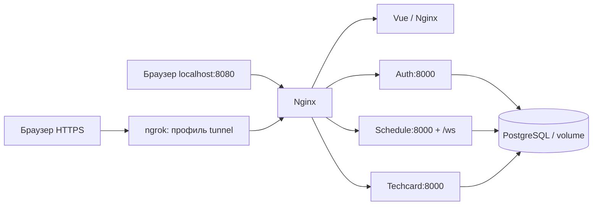

# Локальный запуск через Docker Compose и ngrok

## Требования и схема

Docker Desktop / Docker Engine должен быть запущен. Нужен Compose v2 с поддержкой `up --wait` и Python 3 для вспомогательных скриптов. Node.js, PostgreSQL и Python-зависимости приложения на хосте не нужны.



На хост опубликован только Nginx `127.0.0.1:8080`; в профиле `tunnel` также публикуется инспектор `127.0.0.1:4040`. Ngrok подключается к `http://nginx:80` по сети Compose, поэтому его upstream не зависит от `APP_PORT`.

## Первый запуск

Из корня проекта:

```bash
./scripts/local.sh init
./scripts/local.sh up
./scripts/local.sh check
```

`init` создаёт `.env` с правами `0600`, случайным паролем БД, общим JWT-секретом и отдельным `INTERNAL_API_TOKEN` для аудита auth/schedule. Повторный вызов сохраняет существующие настройки и добавляет только отсутствующий внутренний токен при переходе со старой конфигурации. Файл исключён из Git и контекстов Docker-сборки. `.env` не выполняется как shell-код.

Откройте http://localhost:8080. Сборка frontend выполняется внутри контейнера через `npm ci`; исходники не подключены к контейнерам. После изменения кода повторите `./scripts/local.sh up`, чтобы пересобрать соответствующий образ. Для Vite на хосте `npm run dev` проксирует `/api` на `localhost:8080`; альтернативный upstream задаётся через `VITE_DEV_PROXY_TARGET`. Playwright использует gateway 8080 по умолчанию.

Можно запустить напрямую:

```bash
docker compose config --quiet
docker compose up -d --build --wait --wait-timeout 180
docker compose ps
```

| Адрес | Назначение |
| --- | --- |
| `/` | Vue SPA |
| `/healthz` | Проверка Nginx |
| `/api/auth/health` | Auth и доступность его БД |
| `/api/schedule/health` | Schedule и доступность его БД |
| `/api/techcard/health` | Techcard и доступность его БД |
| `/ws` | WebSocket расписания |

Healthcheck backend возвращает `503`, если проверка `SELECT 1` не проходит. `healthy` подтверждает доступность БД, но не корректность всех пользовательских сценариев. Найденные ошибки приложения перечислены в [плане](DEVOPS_PLAN.md).

## Настройки портов и базы

Для смены порта приложения задайте в `.env`, например:

```dotenv
APP_PORT=8090
ALLOWED_ORIGINS=http://localhost:8090,http://127.0.0.1:8090
```

Затем повторите `./scripts/local.sh up` и `./scripts/local.sh check http://localhost:8090`.

Внутри контейнеров БД всегда доступна по `db:5432`. `DB_PUBLISHED_PORT` применяется только в необязательной debug-конфигурации:

```bash
docker compose -f docker-compose.yml -f docker-compose.debug.yml up -d --build --wait
```

Она дополнительно публикует на `127.0.0.1` PostgreSQL (по умолчанию 5432), auth (8002), schedule (8000), techcard (8001). Для изменения/остановки такого запуска используйте ту же пару файлов. Основные команды `local.sh up/tunnel` используют базовый Compose.

На новом volume PostgreSQL создаёт базы из `AUTH_DB_NAME`, `SCHEDULE_DB_NAME`, `TECHCARD_DB_NAME`. Имена должны быть разными; изменение этих переменных после первого запуска не переименовывает существующие базы. Пароль существующей базы также не меняется при редактировании `.env`. В таких случаях нужны явные операции с БД и резервная копия.

Techcard в Compose использует PostgreSQL. Старые SQLite-файлы автоматически не переносятся; прежде чем переносить существующие данные, выполните отдельную миграцию с проверкой количества карт и этапов. Запуск techcard через Python без `DB_HOST` сохраняет прежний SQLite-режим.

## Alembic и существующие базы

В `main` добавлены baseline-миграции для трёх сервисов. Alembic включён в Docker-образы. Команда применяет миграции именно к PostgreSQL в Compose:

```bash
make migrate
# или ./scripts/local.sh migrate
```

На **пустом volume** её можно выполнить после `init` и перед первым `up`. CI проверяет этот порядок: старт БД → миграции → приложение.

Если приложение ранее создало таблицы через `create_all`, baseline повторно создаст их и завершится ошибкой. Сначала сделайте backup, сравните фактическую схему с baseline и только при совпадении зарегистрируйте конкретную baseline-ревизию через `alembic stamp`. Не применяйте `stamp head` автоматически к неизвестной базе: это может скрыть неприменённые миграции. Ревизии текущего main: auth `7dbb34ee89ea`, schedule `0be27f8a8c89`, techcard `7803079bd1e8`.

`up` пока сохраняет fallback `create_all` из main, поэтому обычный локальный запуск работает и с прежним volume. Переход к обязательным миграциям до старта приложения включён в DevOps-план. Генерация новых revision остаётся отдельной командой `make revision` в локальном Python-окружении с установленным Alembic и правильно выбранной БД.

## Публичный доступ через ngrok

Получите authtoken в [ngrok Dashboard](https://dashboard.ngrok.com/get-started/your-authtoken) и внесите в **локальный `.env`**:

```dotenv
NGROK_AUTHTOKEN=ваш_токен
```

Не добавляйте токен в Git. Затем:

```bash
./scripts/local.sh tunnel
./scripts/local.sh url
```

Первая команда дожидается готовности приложения и запускает ngrok. Если URL ещё не появился, повторите `url` через несколько секунд. Инспектор и сведения о туннеле доступны на http://localhost:4040 (или `NGROK_INSPECT_PORT` из `.env`). Прямой запуск после настройки токена:

```bash
docker compose --profile tunnel up -d ngrok
docker compose --profile tunnel logs --tail=50 ngrok
```

Frontend использует относительный `/api`, поэтому туннелю не нужны отдельные API-адреса, `VITE_API_URL` и пересборка под новый домен. Nginx передаёт внешний Host и HTTPS-схему; backend доверяет заголовкам прокси внутри сети Compose, чтобы перенаправления со слешем сохраняли HTTPS. Для обычного открытия страницы и запросов к тому же домену добавлять ngrok в CORS не требуется. При обращении из приложения на другом origin добавьте конкретный origin в `ALLOWED_ORIGINS` и пересоздайте сервисы.

Бесплатный ngrok может показывать страницу подтверждения перед открытием сайта. Скрипт проверки отправляет `ngrok-skip-browser-warning`, чтобы проверять само приложение:

```bash
./scripts/local.sh check https://ваш-домен.ngrok-free.app
```

Туннель предназначен для демонстрации. Публичная регистрация, владелец техкарты и доступ WebSocket защищены; для старых техкарт без `owner_id` доступ оставлен только менеджерам до выполнения backfill из [плана](DEVOPS_PLAN.md).

## Остановка, диагностика и сохранение данных

```bash
./scripts/local.sh status
./scripts/local.sh logs auth
./scripts/local.sh logs schedule
./scripts/local.sh down
```

`down` останавливает и удаляет контейнеры, включая ngrok, сохраняя volume PostgreSQL. `docker compose down -v` удаляет данные и не нужен для обычной остановки.

Если backend не стартует, проверьте `docker compose logs --tail=100 db auth schedule techcard`. Инициализация БД выполняется только на новом volume; не удаляйте существующий volume, чтобы исправить пароль или имя БД.

Если Docker сообщает `Cannot connect` или отсутствующий `docker.sock`, запустите Docker Desktop. Если занят 8080/4040, задайте другой `APP_PORT` / `NGROK_INSPECT_PORT`. Если ngrok завершился, проверьте `docker compose --profile tunnel logs ngrok`: возможны неверный токен, ограничения аккаунта или сетевой доступ.

Nginx обновляет IP upstream через DNS Docker (`127.0.0.11`, TTL 10 секунд), поэтому после пересоздания отдельного backend адреса обновляются автоматически. Если `502` сохраняется, проверьте состояние upstream и `docker compose logs nginx`.
